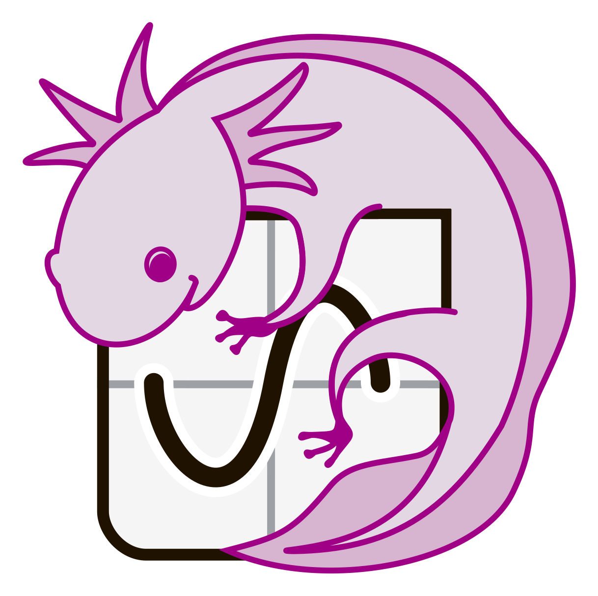
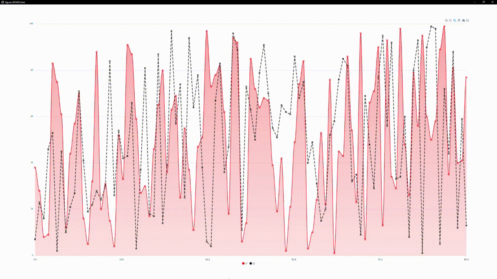
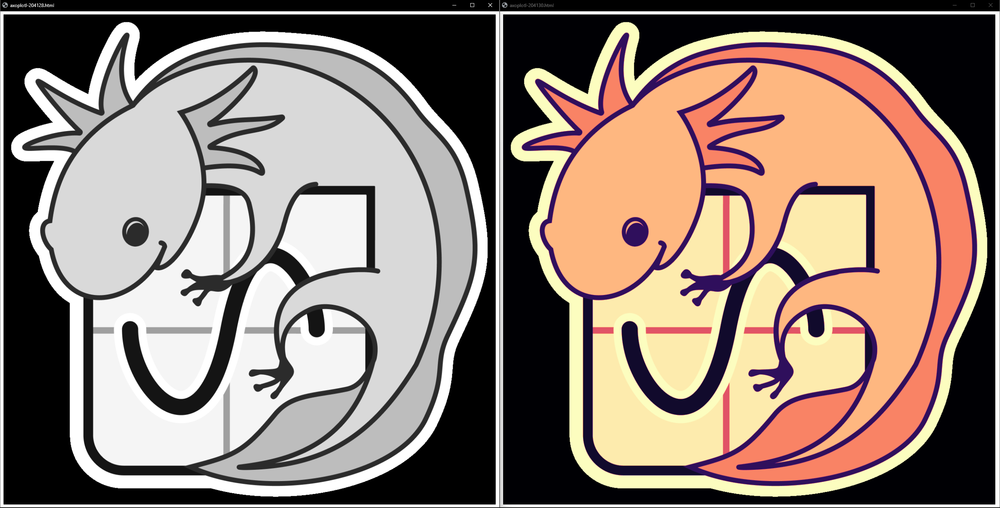

# axoplotl 
### Simple Web Based Plotting Library

<br/>

## About

Axolotl is a plotting library that provides an easy-to-use interface for quickly displaying figures in a system browser using the apexchart.js library

## Usage 

To display data containing series of points use `plot!` macro that allows to include inline stylization of data series by parsing given string literal
```rust
let mut y1: Vec<i32> = (1..100).collect();
let mut y2 = y1.clone();

let mut rng = rand::thread_rng();
y1.shuffle(&mut rng);
y2.shuffle(&mut rng);

plot!(y1, "@r>~"; y2, "k<//3").open()?;
```



<br/>

It's possible to also use declarative flow to create figures
```rust
let fig = FigureBuilder::<Vec<Series>>::default()
    .with_series(
        Series::new(x, y).with_style(
            Style::default()
                .with_color("red")
                .with_marker(Marker::new("circle", 10, true))
                .with_stroke(Stroke::new("smooth", 4, false))
        )
    )
    .build();

assert_eq!(fig, plot!(x, y, "r.10~4"));
```

Axoplotl also let's you quickly debug 2d data by providing macro `imshow!` that allows you to display images with optional color map.
All available color map presets can be found [here](https://github.com/mazznoer/colorgrad-rs#preset-gradients)
```rust
let axoplotl = image::open(r"assets\axoplotl.png")?.to_luma8();

imshow!(axoplotl).open()?;
imshow!(axoplotl, "magma").open()?;
```



<br/>

## Style cheatsheet
- Figure Style
    | normal | area | column |
    |:------:|:----:|:------:|
    | ''     | '@'  | '%'    |

- Series Color
    | black | green | red | cyan | magenta | yellow | orange | black | white |
    |:-----:|:-----:|:---:|:----:|:-------:|:------:|:------:|:-----:|:-----:|
    | 'b'   | 'g'   | 'r' | 'c'  | 'm'     | 'y'    | 'o'    | 'k'   | 'w'   |

- Marker Shape
    | filled | circle | square |
    |:------:|:------:|:------:|
    | true   | '.'    | ','    |
    | false  | '>'    | '<'    |

- Stroke Curve
    | dashed | smooth | straight | stepline |
    |:------:|:------:|:--------:|:--------:|
    | false  | '~'    | '/'      | '-'      |
    | true   | '~~'   | '//'     | '--'     |

## More Style Examples
```rust
// figure of type 'normal' with series of color 'red' with filled circle markers of size 8 and straight lines of width 4
style!("r.8/4")

// figure of type 'area' with series of color '#333' with hollow square markers of size 12 and smooth dashed lines of width 6
style!("@#333<12~~6")

// figure of type 'column' with series of color 'cyan' without markers and straight lines of width 2
style!("%c.0/")
```